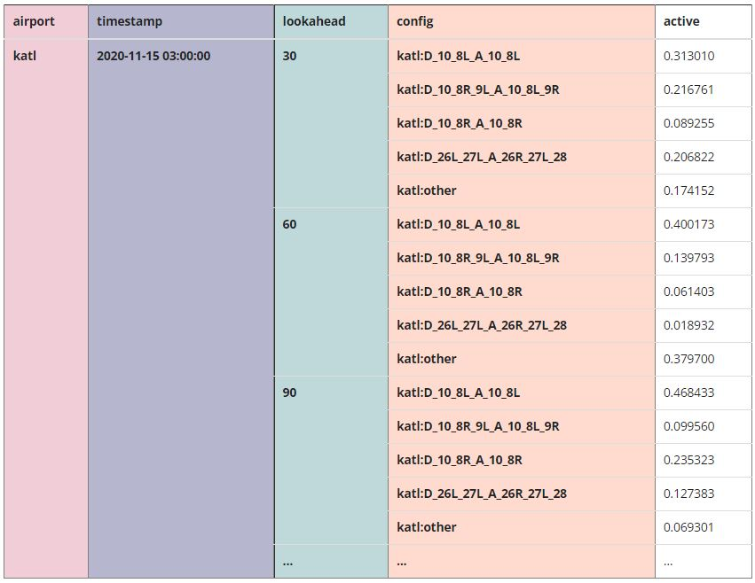
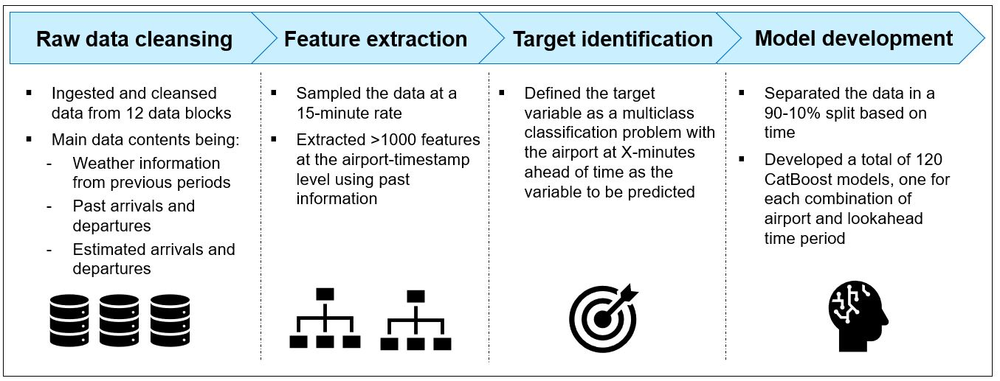
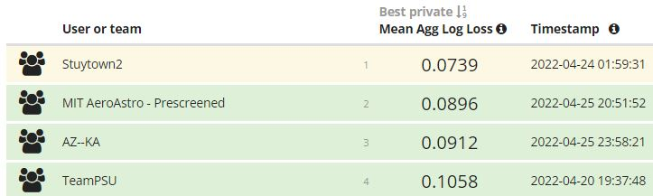

<!-- PROJECT LOGO -->
<br />
<div align="center">
  
  <h3 align="center"> NASA Run-way competition: Predict Reconfigurations at US Airports </h3>

  <p align="center">
    Stuytown team repository to develop the models and serve the prediction functionalities for the 2022 NASA Runway prediction challenge 
    <br />
    <a href="https://www.drivendata.org/competitions/92/competition-nasa-airport-configuration-prescreened/page/440/"><strong>Visit competition site »</strong></a>
  </p>
</div>


<!-- TABLE OF CONTENTS -->
## Table of contents
  <ol>
    <li> <a href="#context-of-the-challenge">Context of the challenge</a> </li>
    <li><a href="#approach-of-our-solution">Approach of our solution</a></li>
    <li><a href="#results-obtained">Results obtained</a></li>
    <li><a href="#repository-structure">Repository structure</a></li>
    <li><a href="#usage">Usage</a></li>
     <ul>
        <li><a href="#prerequisites">Prerequisites</a></li>
        <li><a href="#execution">Execution</a></li>
      </ul>
    <li><a href="#acknowledgments">Acknowledgments</a></li>
  </ol>


<!-- CONTEXT -->
## Context of the challenge

<div style="text-align: justify">

Every year millions of flights arrive and depart from US airports. Intelligent scheduling and system control is a very pressing problem. Knowing in advance or accurately forecasting which runways will be available for departure and arrival is one of the key inputs to arrange optimized schedules. With the surge of Big Data and Advanced Analytics techniques most of these forecasts are based on Machine Learning methods.

In a [2022 analytics competition](https://www.drivendata.org/competitions/89/competition-nasa-airport-configuration/), NASA partnered with DrivenData to facilitate real-world data to develop these types of models and suggest alternative approaches to the [existing research](https://aviationsystems.arc.nasa.gov/publications/2021/20210017593_Khater_Aviation2021_paper.pdf). 

More precisely, participants in this challenge were given the task to build an Advanced Analytics model capable of forecasting the likelihood of multiple configurations taking place for 10 US airports at 12 different time horizons ranging from 30 minutes to 6 hours ahead of time. Each configuration contains information about which runways are open for departure and arrivals respectively and in which direction they can be utilized. 

A graphical representation of the desired output by the model can be observed below as a grid crossing airports, configurations and lookahead periods:



The metric with which the above forecasts are evaluated is with the aggregated logloss across airports and lookahead periods.


<!-- APPROACH -->
## Approach of our solution

With this context in mind, our solution has been to follow a 4-step approach as depicted in the exhibit below:



As one can note, our approach relies on building one model for every combination of airport-lookahead period to predict the likelihood of each possible configuration in the prescribed airport and lookahead horizon. This totals 120 models.

<!-- RESULTS -->
## Results obtained

The results obtained can be split in three different metrics depending on the time period where our models have been evaluated. The open leaderboard is where participants were able to submit the predictions during the development stage, private leaderboard performance was a held out set used to test whether the functionalities in the runtime environment worked correctly, and finally, the held out validation set of May 2022 is where the final ranking was decided.

- Open leaderboard performance: 0.0615 (Rank 5)
- Private leaderboard performance: 0.1043 (Rank 3)
- Held out validation set performance: 0.0739 (Rank 1)

As one can note, based on the evaluation metric with which the final leaderboard was determined, ours was the winning solution. Below one can see the top 4 teams:



<!-- REPOSITORY -->
## Repository structure

The approach and results discussed earlier are structured in two main subrepositories to tackle separate tasks. There is a *training* task under /code and a *prediction* task under /submission. The *training* task consists of a pipeline which loads the raw data, creates a master table and generates 120 models, one for each combination of airport-lookahead. And the *prediction* task is built to run on DrivenData's runtime environment to retrieve live forecasts for new and unseen data. The skeleton of the repository can be found below:

```
NASA-runways
│   README.md
│
└───code
│   │   main.py
│   └───src
│       │   CheckPredictions.py
│       │   CreateMaster.py
│       │   ExtractFeatures.py
|       |   GeneralUtilities.py
|       |   GeneratePredictions.py
│   
└───sumbission
│   │   main.py
│   └───src
│   └───models
└───data
    │   katl
    │   kclt
    │   kden
    │   kdfw
    │   kjfk
    │   kmem
    │   kmia
    │   kord
    │   kphx
    │   ksea
    │   open_submission_format.csv
    │   master_table.parquet
```

<!-- USAGE -->
## Usage

Having an understanding of the approach, results and repository structure, we will cover the usage of the developed code in this fifth section. First studying the necessary requirements and then specifying the execution steps. 

### Prerequisites

In order to execute the routines mentioned above two sets of requirements are needed:

- To execute *main.py* in /submission: Replicate the docker image of the [runtime DrivenData repository](https://github.com/drivendataorg/nasa-airport-config-runtime)
- To execute *main.py* in /code: Use a version of python 3 and have the packages from [*requirements.txt*](https://github.com/alsaco33/NASA-runways/requirements.txt) installed

### Execution

Once the previous requirements are met, the execution of the above pipeline can be executed as seen below once the user specifies the data path where the raw data lives, the models path (where the models will be stored after training) and a binary flag indicating whether we want the master table to be created from scratch or read.

```python 
$ python3 main.py data_path models_path build_master
```

And in order to run the submission *main.py* script in DrivenData's [runtime environment](https://github.com/drivendataorg/nasa-airport-config-runtime):

```python 
main(prediction_time)
```

<!-- ACKNOWLEDGMENTS -->
## Acknowledgments

As a closing remark, we would like to place on record our deepest sense of gratitude towards the NASA and DrivenData teams for organizing and hosting this competition respectively. Their continuous support and encouragement have been invaluable to develop the final product described earlier.

</div>